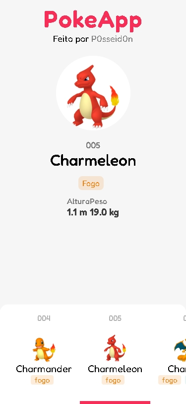
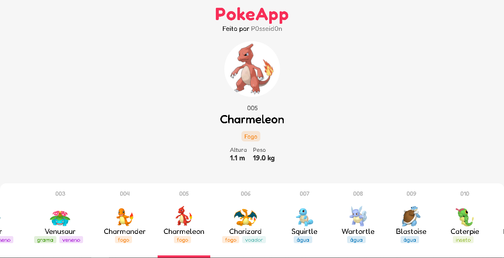

# PokeApp

Aplicação front end listando pokemon

## Ideias de recursos

Ideias para quem tiver interesse de contribuir com o projeto

-  Input para busca de pokemon por nome e id
-  Filtragem por tipos

## Tecnologias

-  Vue3
-  Pinia

## Como ter o projeto

1. Clone o projeto
2. Dentro do projeto instale as dependencias do projeto `npm install`
3. Rode no modo desenvolvimento `npm run dev`
